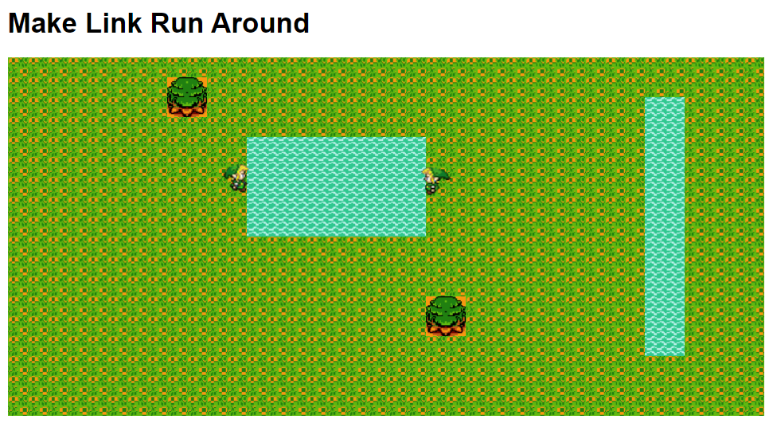

# Introduction

Early on my coding journey in 2014, I wanted to give websockets a go. The idea of creating a real-time application was exciting and I thought a multiplayer browser game would be the best way to learn. I soon realized the difficulty in taking on such a task and left the repo in a buggy state not long after.

I stumbled upon this github repo for my old websocket project and thought it would be a good idea to refactor it and choose it as my showcase. The game is far from finished, but the refactor has given this project a breathe of new life.

The goal of this game is to be the first to find the hidden treasure by running around the map. Other players can join and it can become a hectic race to the prize. Reading the old code felt very nostalgic like it was a letter written to my future self. I could see where I wanted to take this project, but I couldn't help but notice some of my own limitations along the way.



# Walkthrough

## Game Engine

The `GameEngine` has these key properties

```
players = []
world = {
  width: 40,
	height: 20,
  data = [...0,0,0,5,5,5...]
}
```

The numbers in the data grid represent objects that will be generated on the browser. The positioning of elements inherently create the layout of the world. The values also become the bounds for unit collision while moving. If you were to create another level, you would reorganize the values in the array to get new objects and terrain around the map.

```
// generate the html form of the world.data array
 this.drawWorld() = function(){
   var levelObjectsMap = {
      0: 'green',
      2: 'prize',
      5: 'river',
      7: 'upLeftTree',
      8: 'upRightTree',
      9: 'lowLeftTree',
      10: 'lowRightTree'

  }
  ...
  var html = '';
    for(var y=0; y<world.height; y++) {
        html += "<div class='row'>";

        for(var x=0; x<world.width; x++) {
            html += "<div class='";
            html += levelObjectsMap[world.data[y*world.width+x]]
            html += "'></div>"
        }

        html += "</div>";
    }
 }
 $('#container').append(html);

```

```
this.loop = function() {
    players.forEach(function(player){
        player.draw()
    })
}
```

When we instantiate the `GameEngine` it calls these two functions

```
// run it
	this.drawWorld();
	setInterval(this.loop, 50);
```

## Hero

Reminscent of old Gameboy games, the `Hero` uses a spritesheet to animate the character when it's moving in 4 directions.


The hero has a few useful variables that will be used for animation

```
function Hero(name, x, y, grid, direction,counter) {

  this.grid = grid || 41;
  this.gridMovementX = x || -5;
  this.gridMovementY = y || -14;
  this.counter = counter || 1;
  this.direction = direction || "";

  ...
}
```

The Hero has a draw function to bridge the data representation of itself to a html/css version users see on their browser.

```

// use the vars above for sprite sheet positioning
var spritePos = {
  left: this.grid % 2 == 0 ? '150px -1463px' : '-180px -1463px',
  right: this.grid % 2 == 0 ? '150px -490px' : '180px -490px',
  up: this.counter == 1 ?'150px -1236px' : '180px -1236px',
  down: this.counter == 1 ? '150px -912px' :'180px -912px'
}

// this is what the gameloop runs continuously
this.draw = function() {
    $(`.${this.name}`).css({
        top: this.gridMovementY+"px",
        left: this.gridMovementX+"px",
            "background-position": spritePos[this.direction]
    });

}
```

There is 1 main event handler mapped to the W,A,S,D keys for the Hero

```
$(document).keydown(function(e) {
    if(e.keyCode == 65)	{
        player.performAction("MOVE_LEFT");
    }
	...
});
```

When an action is received, the hero's values are updated and sent to the server

```
this.performAction = function(action){
  ...
  if (action == "MOVE_LEFT") {
    if (world.data[this.grid - 1] >= 5) {
        console.log ("Sorry you can't move there");
    } else {
        this.grid -= 1;
        this.gridMovementX -= 20;
        this.direction = 'left'
    }
}
  else if(action == 'MOVE_UP') {
    if (world.data[this.grid - 40] >= 5 ) {
      console.log("sorry you can't move up anymore");
    } else {
        this.grid -= 40;
        this.counter *= -1;
        this.gridMovementY -= 20;
        this.direction = 'up'
    }
  }
  ...

  // after handling all actions
  // socket broadcast to update others
  io.emit('player_movement', {
      player: currentPlayer.name,
      pos: {
          x: this.gridMovementX,
          y: this.gridMovementY,
          grid: this.grid,
          counter: this.counter,
          direction: this.direction
      }
  })
}
```

## Tying it together with sockets

### server - app.js

`player_movement` is received and data is handled and a separate message is sent to other clients

```
const activeUsersMap = {}
socket.on('player_movement', function(data){

    activeUsersMap[data.player]["gridMovementX"] = data.pos.x
    activeUsersMap[data.player]["gridMovementY"] = data.pos.y
    activeUsersMap[data.player]["grid"] = data.pos.grid
    activeUsersMap[data.player]["direction"] = data.pos.direction
    activeUsersMap[data.player]["counter"] = data.pos.counter
    const activeUserList = Object.keys(activeUsersMap).map(key =>  activeUsersMap[key])
    io.emit('update_pos', activeUserList)
  })
```

### client - script.js

`updated_pos` is received and since the game engine is still running, player positions are updated on the browser with `player.draw()`

```
io.on('update_pos', function(data){
    // push them as instances of Hero class to be able to call .draw()
    players = data.map(function(player){
        return new MyHero(player.name, player.gridMovementX, player.gridMovementY, player.grid, player.direction, player.counter)
    })
});
```

# What was refactored

### Riddled with Conditionals

The repition of conditionals throughout the codebase made it unreadable. Utilizing a different data structure when looping makes the implementation much more concise.

```
// old code
if(action == "MOVE_LEFT")
	...
    if (this.grid % 2 == 0)
    {
        $('#my_player').css("background-position","150px -1463px");
    }

    else
    {
        $('#my_player').css("background-position","-180px -1463px");
    }

	...

```

and

```
// old code

if(world.data[y*world.width+x] == 0)
  {
    html += 'green';
  }
...
```

### Side effects all over the place

Not only was there DOM manipulation in `MOVE_LEFT`, but can be found in `this.draw()` also. I wanted to limit the behavior of certain functions. `draw()` should handle the DOM updates, while event handlers handled the data model only.

```
// old code
this.draw = function() {
    $('#my_player').css({top: this.gridMovementY+"px", left: this.gridMovementX+"px" });
}
```

&

```
// old code

if(action == "MOVE_LEFT")
    {
    ...
        else
        {
            this.grid -= 1;
            this.gridMovementX -= 20;
            console.log("grid is ", this.grid, "world.data[this grid] ", world.data[this.grid]);
            if (this.grid % 2 == 0)
            {
                $('#my_player').css("background-position","150px -1463px");
            }

            else
            {
                $('#my_player').css("background-position","-180px -1463px");
            }
        }
    }
```

### Data structure usage unclear and under utilizied, Confusing data flow

- Server stores a hash of users and their positions.
- Hash is transformed into array and sent to clients.
- Clients receive the updated player info and render accordingly.

# Possible Enhancements / Bug Fixes

There are still some bugs with the behavior of the game. A notable bug is the not loading the sprites of the players older than you. The data is correctly available, but the rendering isn't accounting for all of players; only the players that join after you are rendered.

- [ ] Previous players' sprites not loading

## To-Do

- [ ] Add sprites and game mechanic for prizes
- [ ] Add game mechanics (new game, playerboard, etc)
- [ ] Next level, new maps, random map generator
